---
## Front matter
title: "лабораторная работа № 7"
subtitle: "Командная оболочка Midnight
Commander"
author: "НВЕ МАНГЕ ХОСЕ. X.M"

## Generic otions
lang: ru-RU
toc-title: "Содержание"

## Bibliography
bibliography: bib/cite.bib
csl: pandoc/csl/gost-r-7-0-5-2008-numeric.csl

## Pdf output format
toc: true # Table of contents
toc-depth: 2
lof: true # List of figures
lot: true # List of tables
fontsize: 12pt
linestretch: 1.5
papersize: a4
documentclass: scrreprt
## I18n polyglossia
polyglossia-lang:
  name: russian
  options:
	- spelling=modern
	- babelshorthands=true
polyglossia-otherlangs:
  name: english
## I18n babel
babel-lang: russian
babel-otherlangs: english
## Fonts
mainfont: PT Serif
romanfont: PT Serif
sansfont: PT Sans
monofont: PT Mono
mainfontoptions: Ligatures=TeX
romanfontoptions: Ligatures=TeX
sansfontoptions: Ligatures=TeX,Scale=MatchLowercase
monofontoptions: Scale=MatchLowercase,Scale=0.9
## Biblatex
biblatex: true
biblio-style: "gost-numeric"
biblatexoptions:
  - parentracker=true
  - backend=biber
  - hyperref=auto
  - language=auto
  - autolang=other*
  - citestyle=gost-numeric
## Pandoc-crossref LaTeX customization
figureTitle: "Рис."
tableTitle: "Таблица"
listingTitle: "Листинг"
lofTitle: "Список иллюстраций"
lotTitle: "Список таблиц"
lolTitle: "Листинги"
## Misc options
indent: true
header-includes:
  - \usepackage{indentfirst}
  - \usepackage{float} # keep figures where there are in the text
  - \floatplacement{figure}{H} # keep figures where there are in the text
---

# Цель работы

Освоение основных возможностей командной оболочки Midnight Commander. Приоб-
ретение навыков практической работы по просмотру каталогов и файлов; манипуляций
с ними.

# Задание

##Задание по mc:
1. Изучите информацию о mc, вызвав в командной строке man mc.
2. Запустите из командной строки mc, изучите его структуру и меню.
3. Выполните несколько операций в mc, используя управляющие клавиши (операции с панелями; выделение/отмена выделения файлов, копирование/перемещение фай- лов, получение информации о размере и правах доступа на файлы и/или каталоги
и т.п.)
4. Выполните основные команды меню левой (или правой) панели. Оцените степень
подробности вывода информации о файлах.
5. Используя возможности подменю Файл , выполните:
- просмотр содержимого текстового файла;
- редактирование содержимого текстового файла (без сохранения результатов
редактирования);
- создание каталога;
- копирование в файлов в созданный каталог.
6. С помощью соответствующих средств подменю Команда осуществите:
- поиск в файловой системе файла с заданными условиями (например, файла
с расширением .c или .cpp, содержащего строку main);
- выбор и повторение одной из предыдущих команд;
- переход в домашний каталог;
- анализ файла меню и файла расширений.
7. Вызовите подменю Настройки . Освойте операции, определяющие структуру экрана mc
(Full screen, Double Width, Show Hidden Files и т.д.)ю

## Задание по встроенному редактору mc
1. Создайте текстовой файл text.txt.
2. Откройте этот файл с помощью встроенного в mc редактора.
3. Вставьте в открытый файл небольшой фрагмент текста, скопированный из любого
другого файла или Интернета.
4. Проделайте с текстом следующие манипуляции, используя горячие клавиши:
- Удалите строку текста.
- Выделите фрагмент текста и скопируйте его на новую строку.
- Выделите фрагмент текста и перенесите его на новую строку.
- Сохраните файл.
- Отмените последнее действие.
- Перейдите в конец файла (нажав комбинацию клавиш) и напишите некоторый
текст.
- Перейдите в начало файла (нажав комбинацию клавиш) и напишите некоторый
текст.
- Сохраните и закройте файл.
5. Откройте файл с исходным текстом на некотором языке программирования (напри-
мер C или Java)
6. Используя меню редактора, включите подсветку синтаксиса, если она не включена,
или выключите, если она включена.

# Теоретическое введение

 Командная оболочка — интерфейс взаимодействия пользователя с операционной систе-
мой и программным обеспечением посредством команд.
Midnight Commander (или mc) — псевдографическая командная оболочка для UNIX/Linux
систем. Для запуска mc необходимо в командной строке набрать mc и нажать Enter .

Третье  поле экрана, расположенное в нижней части экрана, содержит командную
строку текущей оболочки.  В  этом  же  поле  (самая  нижняя  строка  экрана)
 содержится подсказка по использованию функциональных клавиш F1 - F10.  Самая
       верхняя строка экрана содержит  строку  горизонтального  меню.   Эта  строка
       может  не отображаться на экране; в этом случае доступ к ней можно получить,
       щёлкнув мышью по верхней рамке или нажав клавишу F9.

       Панели Midnight Commander обеспечивают просмотр одновременно двух каталогов.
       Одна  из  панелей  является  активной  в  том смысле, что пользователь может
       выполнять некоторые  операции  с  отображаемыми  в  этой  панели  файлами  и
       каталогами. В активной панели подсвечено имя одного из каталогов или файлов,
       а также выделен цветом заголовок панели в  верхней  строке.  Этот  заголовок
       совпадает  с именем отображаемого в данной панели каталога, который является
       текущим каталогом той оболочки, из которой запущена программа. Вторая панель
       -  пассивна.  Почти  все  операции  выполняются в активной панели, то есть в
       соответствующем (текущем) каталоге. Некоторые операции (типа копирования или
       переноса  файлов)  по умолчанию используют каталог, отображаемый в пассивной
       панели, как место назначения операции. Более подробное описание панелей дано
       в  подразделе  Панели  каталогов  раздела  Меню  левой  и правой панелей и в
       разделе Меню Файл

# Выполнение лабораторной работы

Описываются проведённые действия, в качестве иллюстрации даётся ссылка на иллюстрацию (рис. @fig:001).

Задание по mc:
1. Изучите информацию о mc, вызвав в командной строке man mc.(рис. 
[@fig:001]).

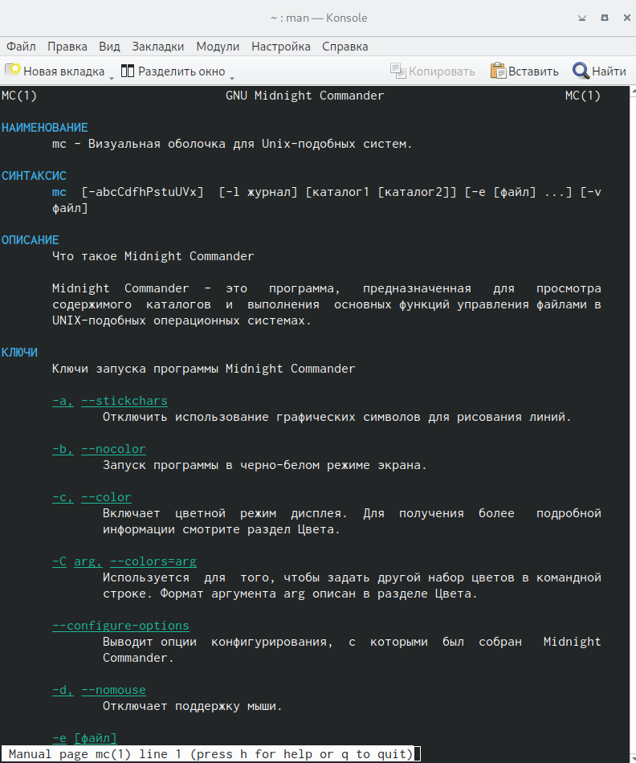{#fig:001 width=70%}

2. Запустите из командной строки mc, изучите его структуру и меню.(рис. [@fig:002]).

{#fig:002 width=70%}

3. Выполните несколько операций в mc, используя управляющие клавиши (операции с панелями; выделение/отмена выделения файлов, копирование/перемещение фай- лов, получение информации о размере и правах доступа на файлы и/или каталоги
и т.п.)(рис. [@fig:003)].

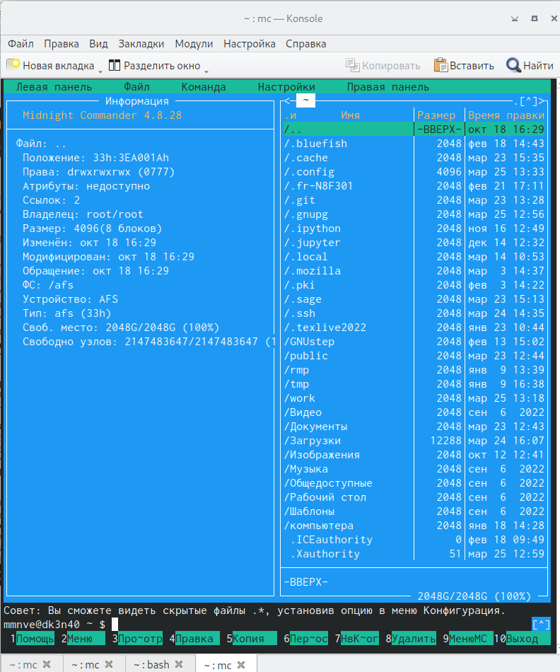{#fig:003 width=70%}

4. Выполните основные команды меню левой (или правой) панели. Оцените степень
подробности вывода информации о файлах.(рис. [@fig:004]).

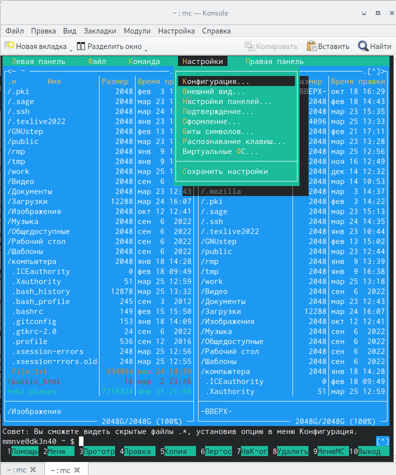{#fig:004 width=70%}

5. Используя возможности подменю Файл , выполните:

- просмотр содержимого текстового файла;
- редактирование содержимого текстового файла (без сохранения результатов
редактирования);
- создание каталога;
- копирование в файлов в созданный каталог.(рис. [@fig:005;@fig:006;@fig:007]).

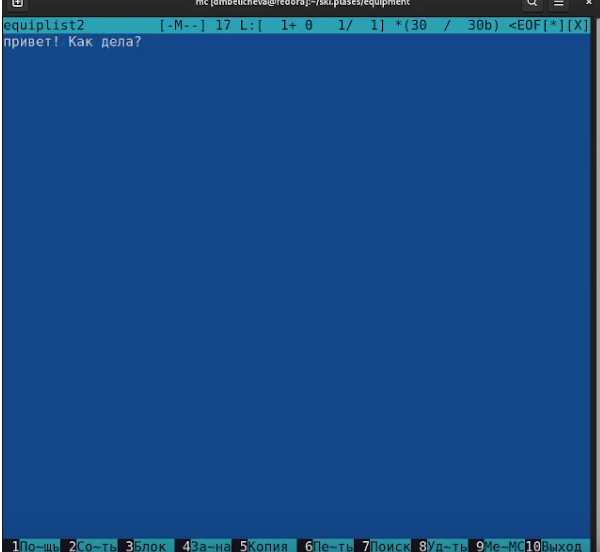{#fig:005 width=70%}

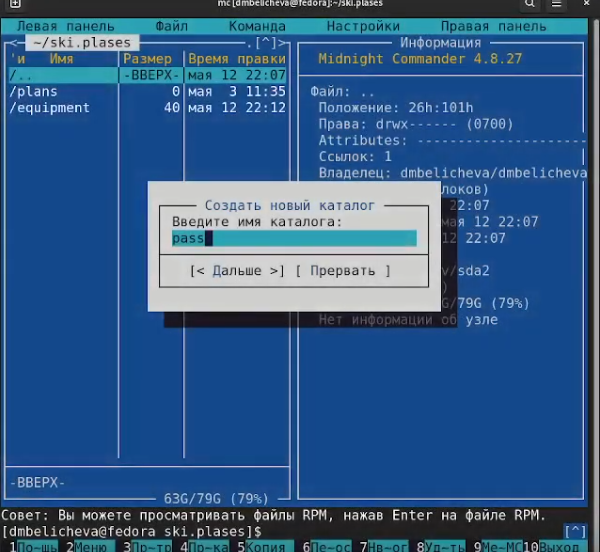{#fig:006 width=70%}

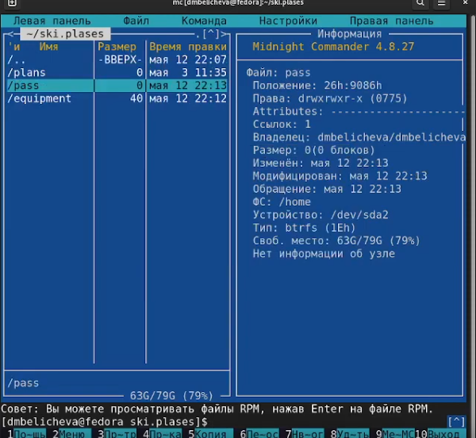{#fig:007 width=70%}

6. С помощью соответствующих средств подменю Команда осуществите:
- поиск в файловой системе файла с заданными условиями (например, файла
с расширением .c или .cpp, содержащего строку main);
- выбор и повторение одной из предыдущих команд;
- переход в домашний каталог;
- анализ файла меню и файла расширений.(рис. [@fig:008;@fig:009;@fig:010;@fig:011]).

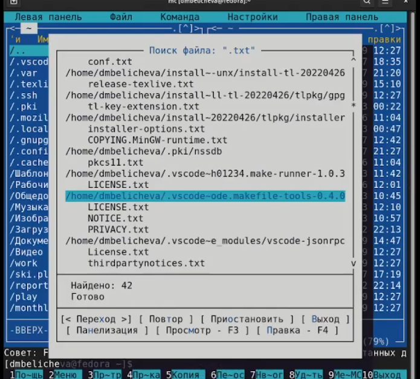{#fig:008 width=70%}

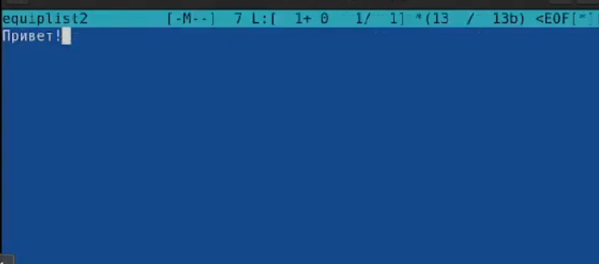{#fig:009 width=70%}

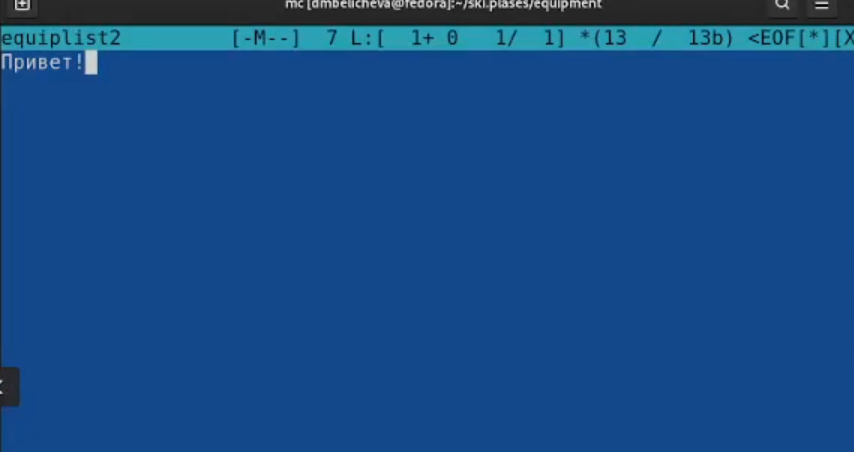{#fig:010 width=70%}

{#fig:011 width=70%}

7. Вызовите подменю Настройки . Освойте операции, определяющие структуру экрана mc
(Full screen, Double Width, Show Hidden Files и т.д.)(рис. [@fig:0012;@fig:013;@fig:014]).

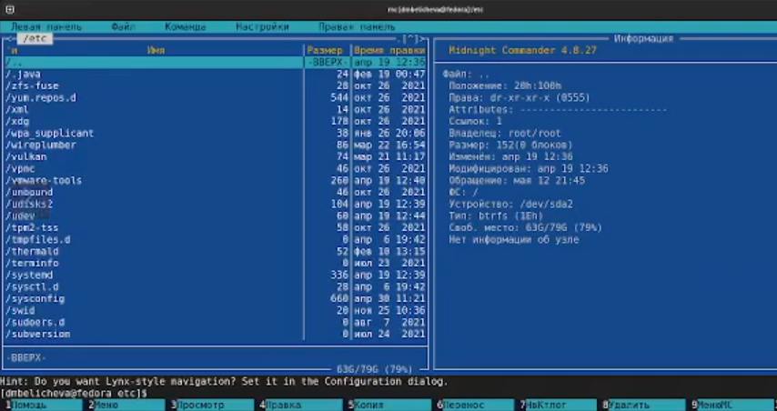{#fig:012 width=70%}

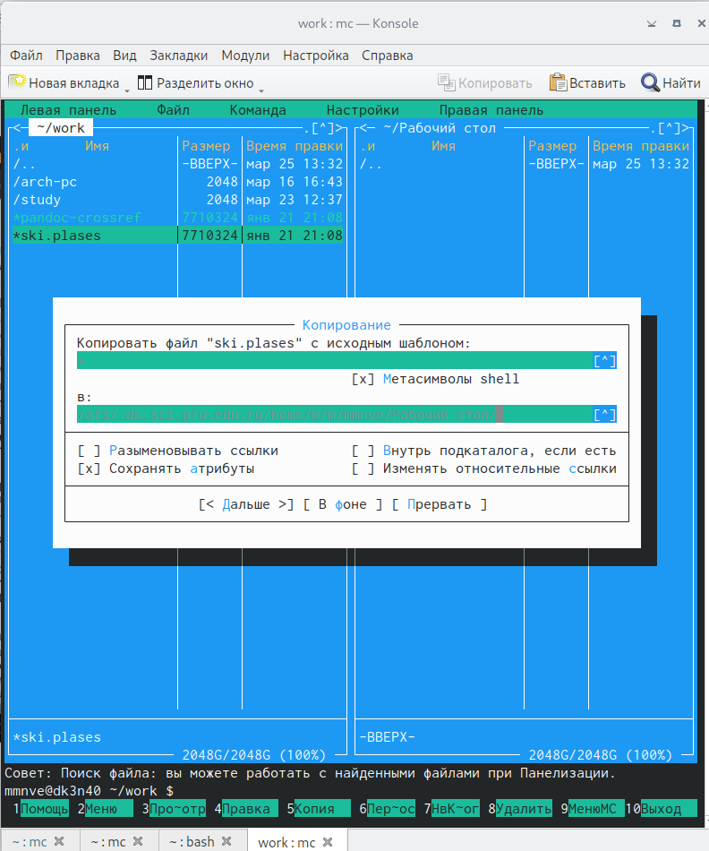{#fig:013 width=70%}

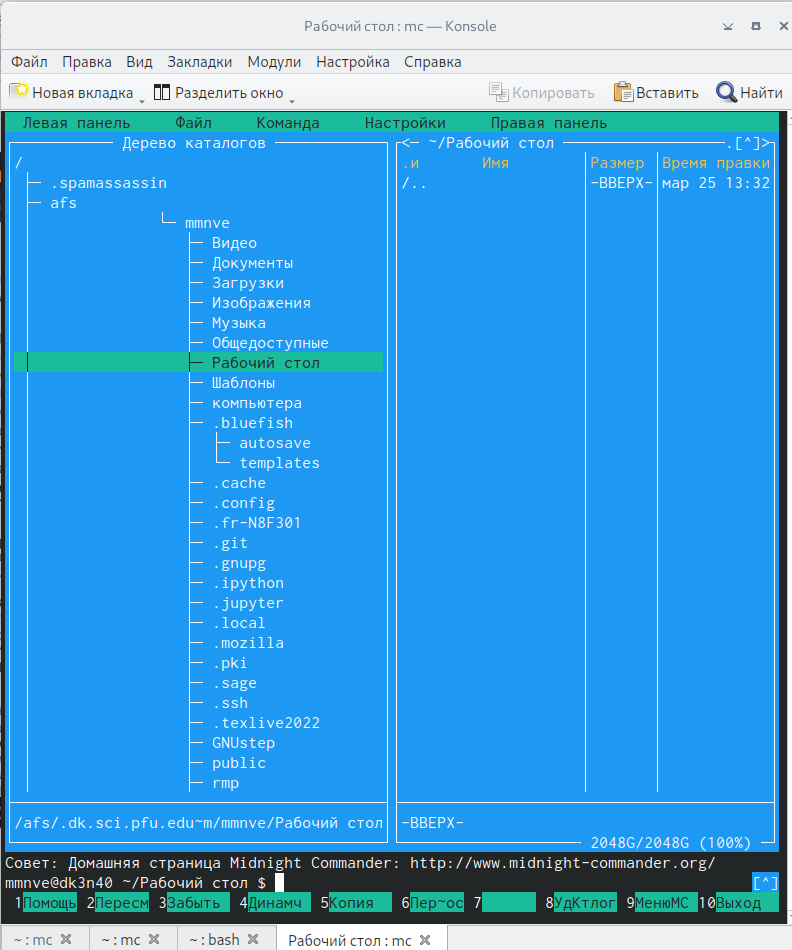{#fig:014 width=70%}

1. Создайте текстовой файл text.txt.
2. Откройте этот файл с помощью встроенного в mc редактора.
3. Вставьте в открытый файл небольшой фрагмент текста, скопированный из любого
другого файла или Интернета.(рис. [@fig:015)].

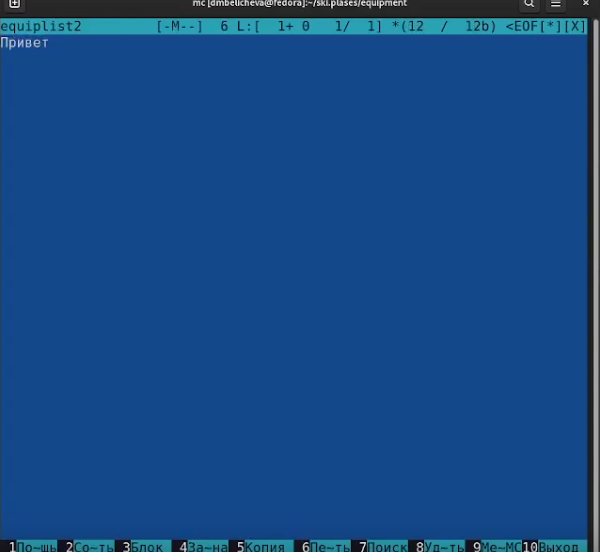{#fig:015 width=70%}

4. Проделайте с текстом следующие манипуляции, используя горячие клавиши:
- Удалите строку текста.
- Выделите фрагмент текста и скопируйте его на новую строку.
- Выделите фрагмент текста и перенесите его на новую строку.
- Сохраните файл.
- Отмените последнее действие.
- Перейдите в конец файла (нажав комбинацию клавиш) и напишите некоторый
текст.
- Перейдите в начало файла (нажав комбинацию клавиш) и напишите некоторый
текст.
- Сохраните и закройте файл.(рис. [@fig:003]).

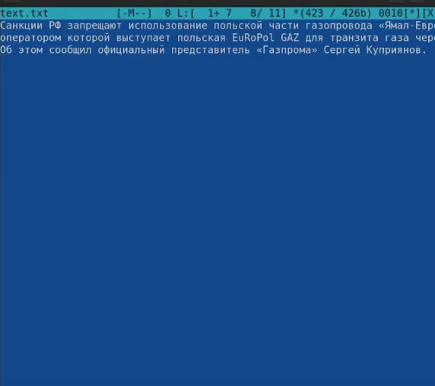{#fig:016 width=70%}

5. Откройте файл с исходным текстом на некотором языке программирования (напри-
мер C или Java)(рис. [@fig:017]).

{#fig:017 width=70%}

6. Используя меню редактора, включите подсветку синтаксиса, если она не включена,
или выключите, если она включена.(рис. [@fig:018]).

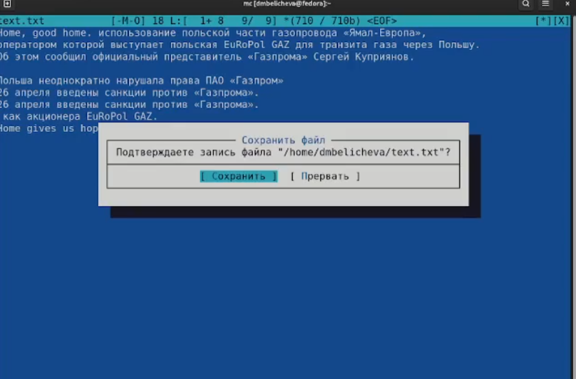{#fig:018 width=70%}

# Выводы

# Список литературы{.unnumbered}

::: {#refs}
:::
