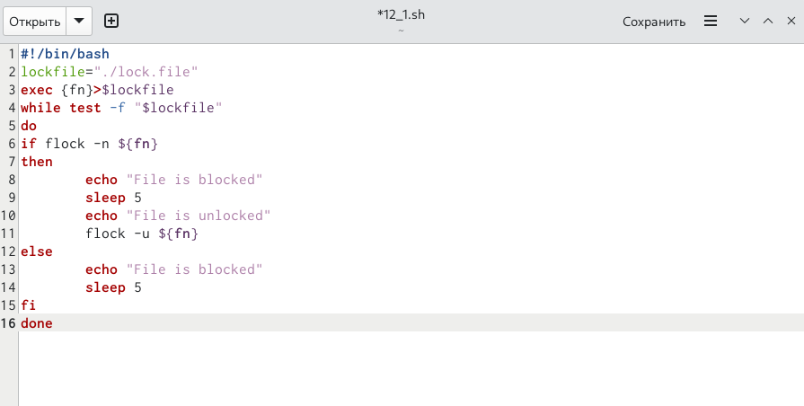
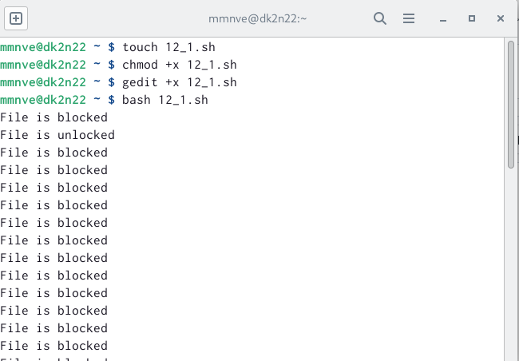
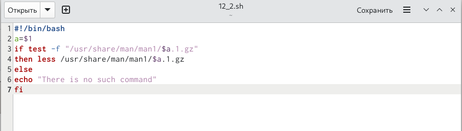
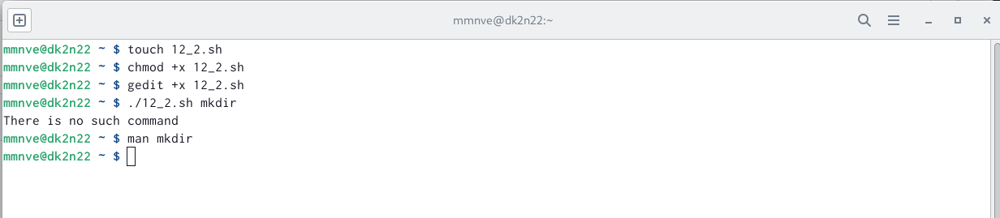
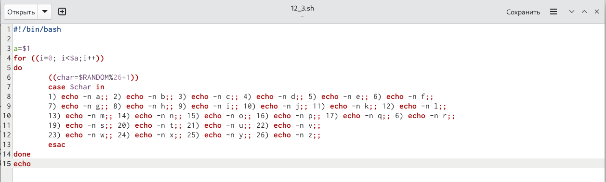
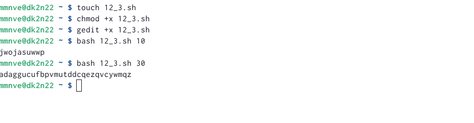

---
## Front matter
lang: ru-RU
title: "Презентация по лабораторной работе №12"
subtitle: "Программирование в командном процессоре ОС UNIX. Расширенное программирование"
author:
  - НВЕ МАНГЕ ХОСЕ. X.M
institute:
  - Российский университет дружбы народов, Москва, Россия
date: 26 апреля 2023

## i18n babel
babel-lang: russian
babel-otherlangs: english

## Formatting pdf
toc: false
toc-title: Содержание
slide_level: 2
aspectratio: 169
section-titles: true
theme: metropolis
header-includes:
 - \metroset{progressbar=frametitle,sectionpage=progressbar,numbering=fraction}
 - '\makeatletter'
 - '\beamer@ignorenonframefalse'
 - '\makeatother'
---

# Информация

## Докладчик

:::::::::::::: {.columns align=center}
::: {.column width="70%"}

 
  * НВЕ МАНГЕ ХОСЕ. X.M
  * Студент 1-го курса, группа НКАбд-03-22
  * математика и Компьютерные науки
  * Российский университет дружбы народов
  * [Ссылка на репозиторий НВЕ МАНГЕ mmnve@dk2n](https://github.com/josegersonmikonve/study_2022-2023_os-intro)
:::
::: {.column width="30%"}

:::
::::::::::::::

# Вводная часть

## Актуальность

  Умение программировать в командном процессоре ОС Unix - очень важный навык для любого IT-специалиста.

## Цели и задачи

  Изучить основы программирования в оболочке ОС UNIX. Научиться писать более сложные командные файлы с использованием логических управляющих конструкций и циклов.

# Основная часть

## Командный файл, реализующий упрощённый механизм семафоров
  

## Реализация механизма семафоров

## Реализация команду man с помощью командного файла

## Реализация команды man при помощи командного файла
  

## Командный файл, генерирующий случайную последовательность букв латинского алфавита
  

## Реализация алгоритма задания 3
  

# Итоговая часть

## Результаты

  В результате выполнения данной лабораторной работы я научилась писать командные файлы, используя логические управляющие конструкции и циклы.

## Итоговый слайд

  Навыки, приобретённые мною в ходе выполнения данной лабораторной работы, пригодятся мне не только в лабораторных работах, но и в будущей профессии.

