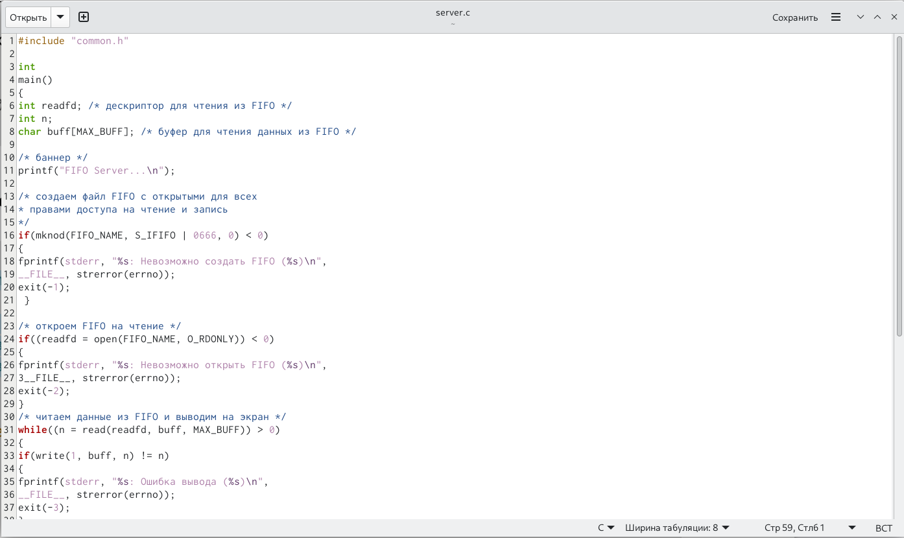

---
## Front matter
lang: ru-RU
title: "Презентация по лабораторной работе №14"
subtitle: "Именованные каналы"
author:
  - НВЕ МАНГЕ ХОСЕ ХЕРСОН МИКО
institute:
  - Российский университет дружбы народов, Москва, Россия
date: 10 мая 2023

## i18n babel
babel-lang: russian
babel-otherlangs: english

## Formatting pdf
toc: false
toc-title: Содержание
slide_level: 2
aspectratio: 169
section-titles: true
theme: metropolis
header-includes:
 - \metroset{progressbar=frametitle,sectionpage=progressbar,numbering=fraction}
 - '\makeatletter'
 - '\beamer@ignorenonframefalse'
 - '\makeatother'
---

# Информация

## Докладчик

:::::::::::::: {.columns align=center}
::: {.column width="70%"}

  * НВЕ МАНГЕ ХОСЕ ХЕРСОН МИКО
  * Студент 1-го курса, группа НКАбд-03-22
  * Математика и Компьютера науки
  * Российский университет дружбы народов
  * [Ссылка на репозиторий НВЕ МАНГЕ mmnve@dk8n](https://github.com/josegersonmikonve/study_2022-2023_os-intro)

:::
::: {.column width="30%"}

:::
::::::::::::::

# Вводная часть

## Актуальность

  Умение работать с именованными каналами - очень важный навык для любого IT-специалиста.

## Цели и задачи

  Приобретение практических навыков работы с именованными каналами.

# Основная часть

## Файл client.c
  

## Файл client2.c

## Файл server.c

## Makefile
  

## Запуск программы
  

# Итоговая часть

## Результаты

  В результате выполнения данной лабораторной работы я приобрела практические навыки работы с именованными каналами.

## Итоговый слайд

  Навыки, приобретённые мною в ходе выполнения данной лабораторной работы, пригодятся мне не только в лабораторных работах, но и в будущей профессии.
